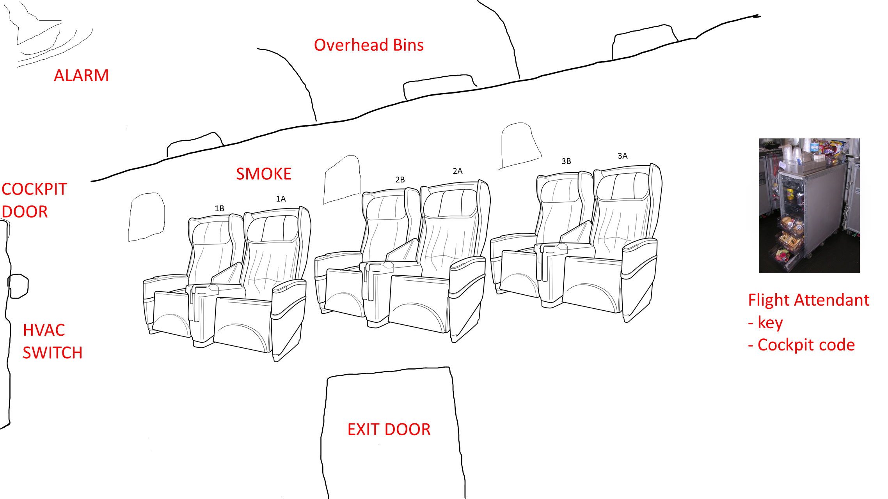

# The Idea
<!-- Jeremy -->
I worked together with a few fine folks from my team on a very fun hackathon project, and I want to tell you about it.

The team was myself ([@codefoster](http://twitter.com/codefoster)), Jennifer Marsman ([@jennifermarsman](http://twitter.com/jennifermarsman)), Hao Luo ([@howlowck](http://twitter.com/howlowck)), Kwadwo Nyarko ([@kjnyarko](http://twitter.com/kjnyarko)), and Doris Chen ([@doristchen](http://twitter.com/doristchen)).

The hackathon was themed on some relatively new products - namely Cognitive Services and the Bot Framework. Additionally, some members of the team were looking for some opportunity to fine tune their Azure Functions skills, so we went looking for an idea that included them all.

I've been mulling around the idea of using some of these technologies to implement an escape room, which as you may know are very popular nowadays. If you haven't played an escape room, perhaps you want to find one nearby and give it a try. An escape room is essentially a physical room that you and a few friends enter and are tasked with exiting in a set amount of time.

Exiting, however, is a puzzle. 

Our escape room project is called Cabin Escape and the setting is an airplane cabin.

# Game Play
<!-- Jeremy -->
Players start the game standing in a dark room with a loud, annoying siren and a flashing light. The setting makes it obvious that the plane has just crash landed and the players' job is to get out.

Players look around in haste, motivated by the siren, and discover a computer terminal. The terminal has some basic information on the screen that introduces itself as CAI (pronounced like _kite_ without the _t_) - the Central Airplane Intelligence system.

A couple of queries to CAI about her capabilites reveal that the setting is in the future and that she is capable of understanding natural language. And as it turns out, the first task of silencing the alarm is simply a matter of asking CAI to silence the alarm.

What the players don't know is that the ultimate goal is to discover that the door will not open until the passenger manifest is "validated," and CAI will not validate the manifest until all passengers are in their assigned seats. The only problem is that passengers don't know what their assigned seats are.

The task then becomes a matter of finding all of the hidden boarding passes that associate passengers with their seats. Once the last boarding pass is located and the last passenger takes his seat, cameras installed in the seat backs finish reporting to the system that the passenger manifest is validated and the exit door opens. 

# Architecture
<!-- Jeremy -->
Talk about the overall architecture and show the diagram

# Cloud Intelligence and Storage
<!-- Kwadwo -->
Talk about the Azure Functions and DocumentDB

# The Controller
<!-- Jeremy -->
Talk about the controller project and the Raspberry Pi that opens doors, turns on HVAC, etc.

# The Central Airplane Intelligence (Cai)
<!-- Jennifer -->
Talk about the bot that interfaces with players

# Cameras and Cognitive Services
<!-- Hao -->
Talk about the device, camera, and software installed on each seatback for identifying players