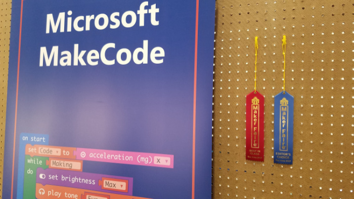
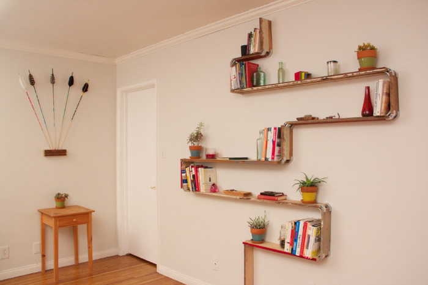
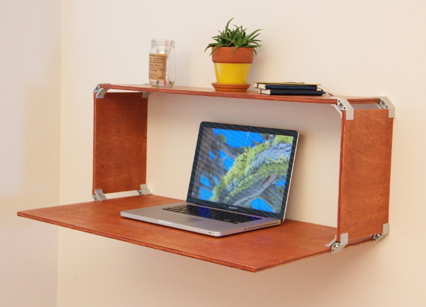

I attended the San Francisco Bay area recently to help welcome makers from around the globe to Maker Faire 2017.

This stalwort of all things maker is an inevitable blast. If you've ever been victim of [_maker's block_](http://www.urbandictionary.com/define.php?term=Maker%27s%20Block), this event will unstick you, and if you've ever been tempted to think that you were the most creative person on earth, this event will offer appropriate humility.

Here are the top 5 things I came across that I can't wait to research, order, make, and talk about...

## Microsoft Make Code
I know it seems like cheating to pick the Microsoft booth for this list since I work there, but hey, it's my blog. And I think I would have picked it anyway, because the impact of the booth was awesome. The folks at Maker Faire seemed to agree too and showed it with two ribbons.

One of the showcased products at the booth was Microsoft [Make Code](http://makecode.com).

Make Code is a new in-browser IDE from Microsoft that makes IoT development with a select few partner hardware boards about as simple as you can imagine. If you own a supported board (which we were giving away all weekend), check out these getting started steps...

1. browse to [makecode.com](http://makecode.com)
1. plug the device in to your USB port

That's it!

We had everyone from 5 to 95 walking through a tutorial to write their first IoT app, and it was brilliant to see so many lights turn on - on the boards and in the minds of the new IoT hackers that were being made.

While I'm on the subject of awesome Microsoft displays, you can't beat the Intelligent Kiosk app for Windows 10 that does a phenomenal job of showing of Microsoft Cognitive Services. This app take a picture every few seconds and runs it through Microsoft's Cognitive Services API. It does things like associate your face with a dog breed, guess your age and gender, or try to determine your emotion. The results are comical.

You can download the app yourself too. There was hardly a single moment the entire 3-day weekend that there wasn't a full crowd around each of two Intelligent Kiosk displays making silly faces and laughing out loud.

## Maslow
Maslow ([maslowcnc.com](http://www.maslowcnc.com/)) is essentially an inexpensive and entirely open project for building a drawbot with a router. You've seen the drawbots before I'm guessing where two motors suspend a pen-wielding carriage on a steeply angled drawing surface. Drawings from the computer are translated into data that drives the motors and extends or retracts the pen to end up drawing a picture.

The Maslow is like that except that instead of a pen, it's a router spinning at tens of thousands of RPM with a razor-sharp bit at the end. Yeah! Additionally, the plunge of the router is controlled, so you can program the depth of cut.

Check this out...

<iframe width="700" height="394" src="https://www.youtube.com/embed/Q-KCZoxvzcQ" frameborder="0" allowfullscreen></iframe>

The net result is the ability to extract whatever 2D shapes you want from a large piece of plywood.

The interesting things about Maslow from my POV are...

* It's _cheap_. You can get kits for under $500 to put the entire thing together
* It's _compact_. Since it's upright, you can fit it in a tight space.
* It's _open_. You can extend or adapt the project to your needs.

## Goliath CNC
Similar to the Maslow CNC router I already mentioned, the  [Goliath CNC](https://www.facebook.com/goliathcnc/) project cuts things out for you, except instead of suspending a carriage it has you leave your workpiece flat and drives around it on a robot.

It's like this...
<iframe width="700" height="393" src="https://www.youtube.com/embed/ziOvO4VgCxc" frameborder="0" allowfullscreen></iframe>

Sometime ago I looked into the [Shaper Origin](https://shapertools.com/) and got excited about the ability to cut things out of stock of whatever size. Traditional CNC routers constrain you to a fixed size for your work piece. The impressive thing about both the Maslow and the Goliath as compared to the Origin is that not only do you get the infinite working area, but you don't have to directly attend the cut. I wouldn't leave the room, mind you, but the operator's role is reduced from router-weilder to router-sitter, and that's a bit of a relief.

I don't know which - if any - of these machines will rise to earn the title of _most useful_ in the long run, but they are all super good ideas and I'm excited to see evolve.

## Monoprice 3D Printers
I'm big on 3D design, but I've yet to purchase my own 3D printer. This is partly due to the fact that I have access to some in nearby maker spaces.

If I were to purchase a printer today, though, I think I'd get one from [Monoprice](http://monoprice.com). Their [MP Select Mini 3D Printer V2](https://www.monoprice.com/product?c_id=107&cp_id=10724&cs_id=1072403&p_id=21711&seq=1&format=2) is only $219, and their new Mini Delta 3D is available (for only 5 more days!) [on Indiegogo for only $169!](https://www.indiegogo.com/projects/monoprice-mini-delta-affordable-starter-3d-printer#/)

You can count on problems with a printer at these price points, but then, you can pretty much count on problems with 3D printers at most price points. It's hard to make a system reliable when there are so many variables.

The Monoprice's printers are quite popular would seem to indicate ready availability of replacement parts to either buy or print.

Monoprice represented at the faire this year and showed off both their classic Mini as well as the new delta, and it's great to see both in action.

## PLY90
Sometimes it's the simple things that have huge impact - like [PLY90](http://www.plyproducts.com/pages/ply90).

PLY90 is an aluminum bracket that holds plywood together at a 90 degree angle. Simple. But the projects you can make from something like this are endless. Here are a few I liked...

See more designs that take advantage of the PLY90 bracket at [plyproducts.com/collections/projects](https://www.plyproducts.com/collections/projects).

## Hydroponics A-Frame System
Bruce Gee of [Waterworks](http://waterworks-hydro.com/) was fascinating to listen to as evidenced by the constant crowd of folks standing around asking questions and busily writing down what he shared about his hydroponics experience. Bruce has a way of making hydroponics sound _easy_.

Bruce used simple and inexpensive lumber and PVC pipe to create an A-shaped structure for running water over the roots of plants, and that was pretty much the end of the story. Most hydroponics systems I've seen incorporate lighting and control systems that certainly add to crop growth, but also to overall complexity and threaten to to intimidate your average home farmer.

***

If you have never been to a Maker Faire, I beg you go to [makerfaire.com](http://makerfaire.com) and find one near you. We are all creators. You are too. 

So what's your next creation?!