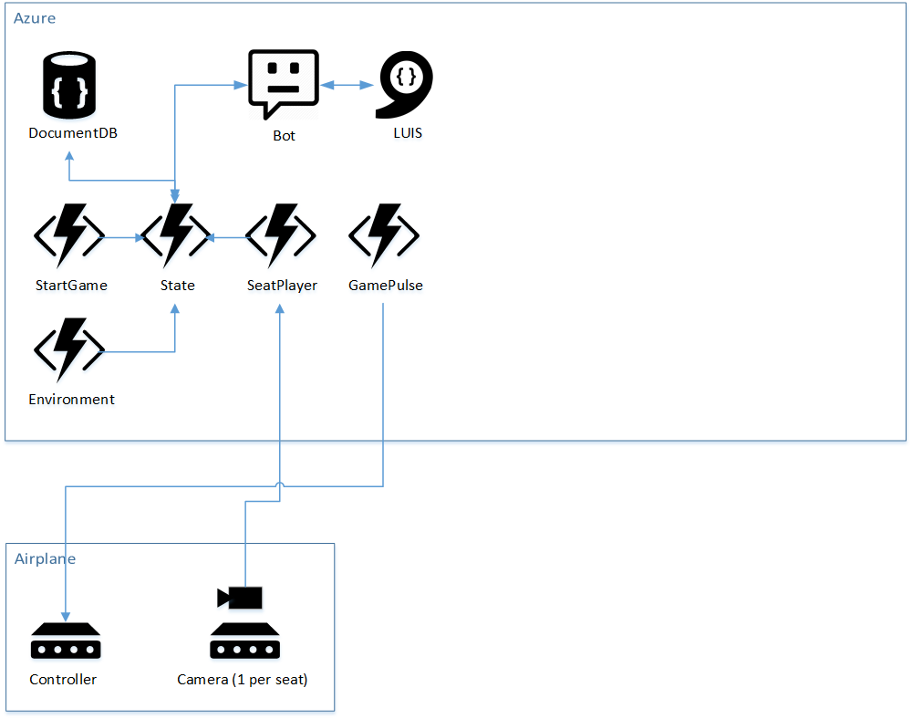

# The Idea
<!-- Jeremy -->
I worked together with a few fine folks from my team on a very fun hackathon project, and I want to tell you about it.

The team was myself ([@codefoster](http://twitter.com/codefoster)), Jennifer Marsman ([@jennifermarsman](http://twitter.com/jennifermarsman)), Hao Luo ([@howlowck](http://twitter.com/howlowck)), Kwadwo Nyarko ([@kjnyarko](http://twitter.com/kjnyarko)), and Doris Chen ([@doristchen](http://twitter.com/doristchen)).

Here's our team...

The hackathon was themed on some relatively new products - namely Cognitive Services and the Bot Framework. Additionally, some members of the team were looking for some opportunity to fine tune their Azure Functions skills, so we went looking for an idea that included them all.

I've been mulling around the idea of using some of these technologies to implement an escape room, which as you may know are very popular nowadays. If you haven't played an escape room, perhaps you want to find one nearby and give it a try. An escape room is essentially a physical room that you and a few friends enter and are tasked with exiting in a set amount of time.

Exiting, however, is a puzzle. 

Our escape room project is called Cabin Escape and the setting is an airplane cabin.

# Game Play
<!-- Jeremy -->
Players start the game standing in a dark room with a loud, annoying siren and a flashing light. The setting makes it obvious that the plane has just crash landed and the players' job is to get out.

Players look around in haste, motivated by the siren, and discover a computer terminal. The terminal has some basic information on the screen that introduces itself as CAI (pronounced like _kite_ without the _t_) - the Central Airplane Intelligence system.

A couple of queries to CAI about her capabilites reveal that the setting is in the future and that she is capable of understanding natural language. And as it turns out, the first task of silencing the alarm is simply a matter of asking CAI to silence the alarm.

What the players don't know is that the ultimate goal is to discover that the door will not open until the passenger manifest is "validated," and CAI will not validate the manifest until all passengers are in their assigned seats. The only problem is that passengers don't know what their assigned seats are.

The task then becomes a matter of finding all of the hidden boarding passes that associate passengers with their seats. Once the last boarding pass is located and the last passenger takes his seat, cameras installed in the seat backs finish reporting to the system that the passenger manifest is validated and the exit door opens. 

# Architecture
<!-- Jeremy -->
Architectures of old were almost invariably n-tiered. We software developers are all intimately familiar with that pattern. Times they are a changing! An n-tier monolithic architecture may accomplish your feat, but it won't scale in a modern cloud very well.

The architecture for cabin escape uses a smattering of platform offerings. What does that mean? It means that we're not going to ask Azure to give us one or more computers and then install our code on them. Instead, we're going to compose our application out of a number of higher level services that are each indepedent of one another.

Let's take a look at an overall architecture diagram.

In Azure, we're using stateless and serverless Azure Functions for business logic. This is quite a paradigm shift from classic web services are often implemented as an API.

API's map to nodes (servers) and whether you see it or not, when your application is running, you are effectively renting that node.

Functions, on the other hand do not conceptually map to servers. Obviously, they are still running on servers, but you don't have to be in the business of declaring how Functions' nodes scale up and down. They handle that implicitly. You also don't pay for nodes when your function is not actually executing.

The difficult part in my opinion is the conceptual change where with a serverless architecture, your business logic is split out into multiple functions. At first it's jarring. Eventually, though you start to understand why it's advantagous.

If any given chunk of business logic ends up being triggered a lot for some reason and some other chunk doesn't, then dividing those chunks of logic in different functions allows one to scale while the other doesn't.

It also starts to feel good from an encapsulation stand point.

Besides Functions, our diagram contains a DocumentDB database for state, a bot using the Bot Framework, LUIS for natural language recognition, and some IoT devices installed in the plane - some of which use cameras.

# Cameras and Cognitive Services
<!-- Hao and Doris -->
(Coming soon)

# Cloud Intelligence and Storage
<!-- Kwadwo -->
We use Azure Functions to update and retrieve the state of the game. Our Azure Functions are stateless, however we keep the state of every game stored in DocumentDB. In our design, every Cabin Escape room has its own document in the state collection. For the purpose of this project, we have one escape room that has id 'officialGameState'. 

We started by creating a 'GameState' DocumentDB database, and then creating a 'state' collection. This is pretty straight forward to do in the Azure portal. Keep in mind you'll need a DocumentDB account created before you create the database and collection. 

After setting up the database, we wrote our Azure Functions. We have five functions used to update the game state, communicate with the interactive console (Central Airplane Intelligence - Cai for short), and control the various systems in the plane.Azure Functions can be triggered in various ways, ranging from timed triggers to blob triggers. Our trigger based functions were either HTTP or timer based. Along with triggers, Azure Function can accept various inputs and outputs configured as bindings. Below are the functions in our cabinescape function application.

    - GamePulse: 
        * Retrieves the state of the plane alarm, exit door, smoke, overhead bins and sends commands to a raspberry piece
        * Triggerd by a timer
        * Inputs from DocumentDB
    - Environment:
        * Updates the state of oxygen and pressure
        * Triggered by a timer
        * Inputs from DocumentDB
        * Outputs to DocumentDB
    - SeatPlayer:
        * Checks to see if every player is in their seat
        * Triggerd by HTTP request
        * Inputs from DocumentDB
        * Outputs to DocumentDB and HTTP response
    - StartGame: 
        * Initializes the state of a new game
        * Triggered by HTTP request
        * Outputs to DocumentDB and HTTP response
    - State:
        * Update the state of the game
        * Triggered by HTTP request
        * Inputs from DocumentDB
        * Ouputs to DocumentDB

A limitation we encountered with timer based triggers is the inability to turn them on or off at will. Our timer based functions are on by default, and are triggerd based on an interval (defined with a cron expression).

In reality, game is not being played 24/7. Ideally, we want the timer based functions triggered on when the game starts, and continue on an time interval until the game end condition is met.

# The Controller
<!-- Jeremy -->
An escape room is really just a ton of digital flags all over the room that either inquire or assert the binary value of some feature.

* Is the lavatory door open (inquire)
* Turn the smoke machine on (assert)
* Is the HVAC switch in the cockpit on? (inquire)
* Turn the HVAC on (assert)

It's quite simply a set of inputs and outputs, and their coordination is a logic problem.

All of these logic bits, however, have to exist in real life - what I like to call _meat space_, and that's the job of the controller. It's one thing to change a digital flag saying that the door should be open, but it's quite another to actually open a door.

The contoller in our solution is a Raspberry Pi 3 with a Node.js that does two things: 1) it reads and writes theh logical values of the GPIO pins and 2) it dynamically creates an API for all of those flags so they can be manipulated from our solution in the cloud.

To scope this project to a 3-day hackathon, the various outputs are going to be represented with LEDs instead of real motors and stuff. It's meat space, but just barely. It does give everyone a visual on what's going on in the fictional airplane.

# The Central Airplane Intelligence (Cai)
<!-- Jennifer -->
(Coming soon)

# Cameras and Cognitive Services
<!-- Hao -->
(Coming soon)
