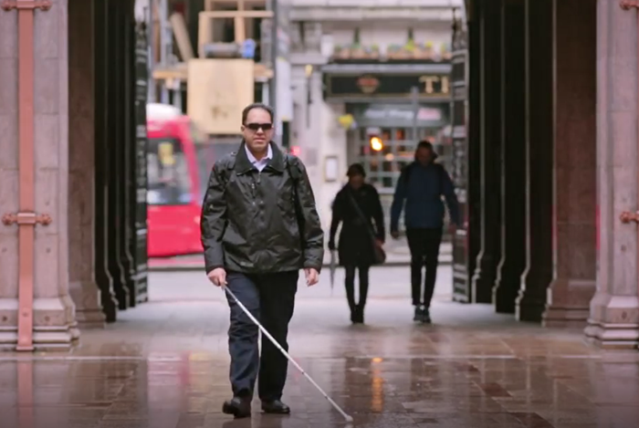

> You can view or download the PowerPoint deck for this presentation at [http://codefoster.com/deck/cww2017](codefoster.com/deck/cww2017).

I delivered a session today at [Code Writer's Workshop](https://www.codewritersworkshop.com/events/seattle) in Seattle.

Code Writer's is a meta-topic workshop. By that I mean that you don't attend to learn how to create a web service or how to implement MQTT messaging. You go to learn about all the other topics that revolve around a career in software development.

My sesson was titled _Developer Life Skills_, and it was easily the softest topic I've delivered to date.

The goal was to look both at how a software engineer can apply his particular skills to the rest of life - eating, family, sleeping, productivity, etc. as well as to explore how these lateral life topics affect their day-to-day work.

I ventured out a bit and organized my content into 5 chapters - meaning, beauty, truth, community, and efficiency.

## Meaning
My first goal was to dash hopes and dreams by reminding the audience that technology is intrinsically meaningless. It's true. We spend so much time on technology itself, when the really interesting things happen in the _application_ of technology and especially in applications that enrich lives and enable people.

I showed [a video](http://www.youtube.com/watch?v=R2mC-NUAmMk) that I love about Saqib - a software developer at Microsoft who's blind and who created an application that allows him to have whatever he's looking at explained to him. It's a great example of technology that enriches life.

## Beauty 
You might wonder how _beauty_ applies to software development. I did too until I thought about it and did some research.

Among other points, I shared how my definition of beauty has less to do with attractiveness and more to do with severity. I shared one example from my life where I experienced the most raw, real beauty - on a big ocean sail trip down the west coast where I watched a sunrise all alone for more than 2 hours, feared for my life in large seas, and was inspected closely by a curious fin whale for a full 45 minutes.

Those of us involved in the creation of software have the relatively rare opportunity to explicitly work on something that's both creative and very technical, and that's a lot of fun.

## Truth
Next up was _truth_.

I've long thought that most any venture and certainly a technical venture is made up of...

You might have all of the resources and tools you need for the job, but without the passion and vision and inspiration, you'll have a tremendous headwind.

Another of my favorite life lessons in the truth category is that when you are trudging through new concepts and feel lost... keep trudging! You're learning all the while even though you don't understand yet, and in fact, you're very likely expanding your mind not only to new information, but new concepts altogether. If you bail you'll miss out and if you make a habit of bailing you'll wind up narrow.

## Community
Next up, in the topic on _community_, I reminded folks that we build software together and we rely on each other.

I learned in scuba diving training a long time ago, that at some point you take what you've learned about keeping _yourself_ alive, and you apply it to the divers around you. You show up at a dive site with all of your preparation done, safety checks made, and redundant gear ready, and then you look at the guy next to you and make sure he's ready and able and safe.

I also asked what's more important to a software language, platform, or framwork: _great syntax and features_ or a strong _developer community_. The former is obviously important, but not so much, I would argue, as the latter.

## Efficiency
Finally, I said that we need to be efficient and productive in the entire course.

I mentioned the importance of exercise, the importants of a refined and focused personal mission statement, and I shared how much I've benefit from eliminating decision fatigue by [drinking Soylent](http://codefoster.com/soylent) for certain meals and buying 10 identical copies of some articles of clothing.

You can download the entire deck at [http://codefoster.com/deck/cww2017](codefoster.com/deck/cww2017).