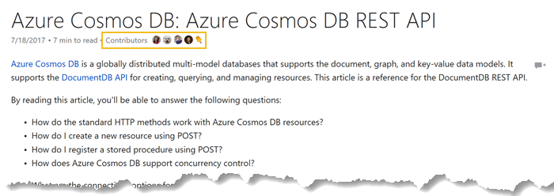

News flash. Microsoft is a big company.

It's _people_ big. I have hundreds of thousands of colleagues.

It's _geography_ big. We have offices, cloud datacenters and regions, and products around the globe.

It's _facility_ big. We have many campuses and hundreds of buildings here in the Pacific Northwest and more around the world.

It's also _products and services_ big. We have hundreds of products, services, platforms, libraries, frameworks, and hardware products by which we attempt to fulfill our mission statement _to empower every person and every organization on the planet to achieve more_.

As a developer, I think of Microsoft as an ecosystem, and it is increasingly an open ecosystem that provides essential developer tools without locking in the people that are building things. We all hate vendor lock-in.

Sometimes when you're using a single product, a service, or a framework, it's easy to get confused or overwhelmed when there are multiple entry points into the documentation, and when you're talking about a developer _ecosystem_ it's even worse.

If you're a developer, then, I want you to know that there's...

** ONE LINK TO RULE THEM ALL **

...there's [docs.microsoft.com](http://docs.microsoft.com)

Here's what that looks like in your browser...

This site is _the home for Microsoft technical documentation, API reference, code examples, quickstarts, and tutorials for developers and IT professionals_, and it is your single entry point for learning how to consume an Azure service, install Visual Studio, build a Docker image for a .NET Core Application, use the Node.js Driver for SQL Server, interact programmatically with your Azure bill, and loads more.

Are you looking for the [Azure Application Architecture Guide](https://docs.microsoft.com/en-us/azure/architecture/guide/). Look no further. 

Do you want to [get started building a bot](https://docs.microsoft.com/en-us/bot-framework/bot-builder-overview-getstarted)? Have at it.

Need the skinny on [Authenticating Users with Forms Authentication using Visual Basic](https://docs.microsoft.com/en-us/aspnet/mvc/overview/older-versions-1/security/authenticating-users-with-forms-authentication-vb)? Uh... okay... there you go.

In the past, you may have visited [MSDN](http://msdn.microsoft.com) or [TechNet](http://technet.microsoft.com) to get the lowdown on how to do what, but going forward, it's all migrating to Docs.

You should take note too that many of the documentation pages have a header like the following with a date, an indication of average time to read (super helpful), and a list of contributors...

So Microsoft's documentation, like code itself, is a collaborative effort - an open source project - and in many cases you're encouraged to contribute! Just look for an _Edit_ link like this one, and you'll be whisked away to the GitHub repo where you can fork and PR.

Finally, have a glance at the [Docs team's blog](https://docs.microsoft.com/en-us/teamblog) to see what's new. For instance, did you know there's a new [PowerShell Module Browser](https://docs.microsoft.com/en-us/teamblog/announcing-unified-powershell-experience/)? Yeah, I didn't either.

Have fun.