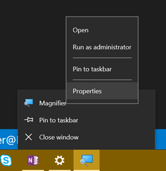

I do a lot of presentations. The only thing I like more than writing code is _talking_ about writing code.

I've always had a little angst about zooming my screen though because...

* The built-in Windows Magnifier seemed to get in my way

* The excellent and popular Zoom It tool requires an extra install and I never seem to have it running when my presentation starts.

I recently discovered, though, a couple of options that make theh built-in Windows Magnifier work way better for me.

First, I looked up the keyboard shortcuts and beyond the basics of `WIN + =` for zooming in and `WIN + -` for zooming out, you can use `WIN + ESC` to exit the zoom altogether. Prior to discovering that, I thought it was necessary to zoom all the way back out. I also found that `CTRL + ALT + Mouse Wheel` works to zoom in and out with your mouse.

Now, my biggest aggravation with the Magnifier was how the UI rendered every time I performed a zoom. There's a Magnifier settings to "Collapse to magnifying glass icon". That's better than the full window, but it's still fairly obtrusive. So here's the trick.

1. Start Magnifier so the icon appears on the Task Bar.

1. Now right click on the Magnifier icon, right click on the Magnifier entry in the context menu, and hit Properties.

    

1. Now set Run to Minimized

    

That's it. Now when you hit `WIN + =` to zoom in, the screen zooms in to the mouse cursor and doesn't render any obtrusive UI.

It's the simple things that light me up!

> Quick note. A colleague just read and tried this and it didn't seem to work for him. I tried it again and the behavior is not exactly like I indicated in this post. I spent some time trying to figure out exactly what's up, and I figured out that if the magnifier is _not_ running, then it will still create the UI. If you check the box I mentioned to earlier - Collapse to magnifying glass icon - the UI is smaller, but it's still there. The application is not active, but if it happens to show up where your cursor is, then it's still obstructive. So, I am going to submit this feedback to the Windows team to see if I can be an advocate of change. It does help if you move the Magnifier's window to a remote area of the screen, and you can also just minimize it, but both of those take a little effort. Anyway, we'll get this figured out :) 

> Okay, folks. I submitted this feedback via Windows Feedback and it was promoted to bug 16580796 within the hour. Impressed. Fingers crossed this is fixed in the next Windows update.